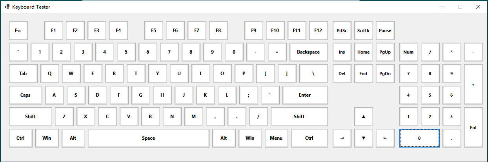

# KeyCheck - 键盘按键功能测试

KeyCheck 是一个基于 C# WinForms 开发的轻量级键盘测试工具。它可以帮助用户检测键盘按键是否正常工作，通过可视化的虚拟键盘实时显示按键状态。



## 功能特点

*   **实时响应**：按下键盘上的键时，屏幕上的虚拟按键会立即高亮显示（浅绿色），释放后恢复。
*   **完整布局**：支持标准 104/108 键布局，包括主键盘区、功能键区（F1-F12）、导航键区（Insert/Delete/Home/End等）以及方向键。
*   **数字小键盘**：包含完整的数字小键盘区域支持。
*   **精准布局**：精心调整的按键位置和间距，模拟真实键盘布局体验。
*   **多键无冲测试**：支持同时按下多个按键的检测（受限于硬件键盘本身的无冲能力）。

## 系统要求

*   Windows 操作系统
*   .NET 10.0 (本项目使用最新的 .NET 版本)

## 开发环境

*   语言：C#
*   框架：Windows Forms (WinForms)


## 如何运行

1.  克隆本项目到本地：
    ```bash
    git clone https://github.com/hyang0/KeyCheck.git
    ```
2.  进入项目目录：
    ```bash
    cd KeyCheck
    ```
3.  使用 .NET CLI 构建并运行：
    ```bash
    dotnet run
    ```
